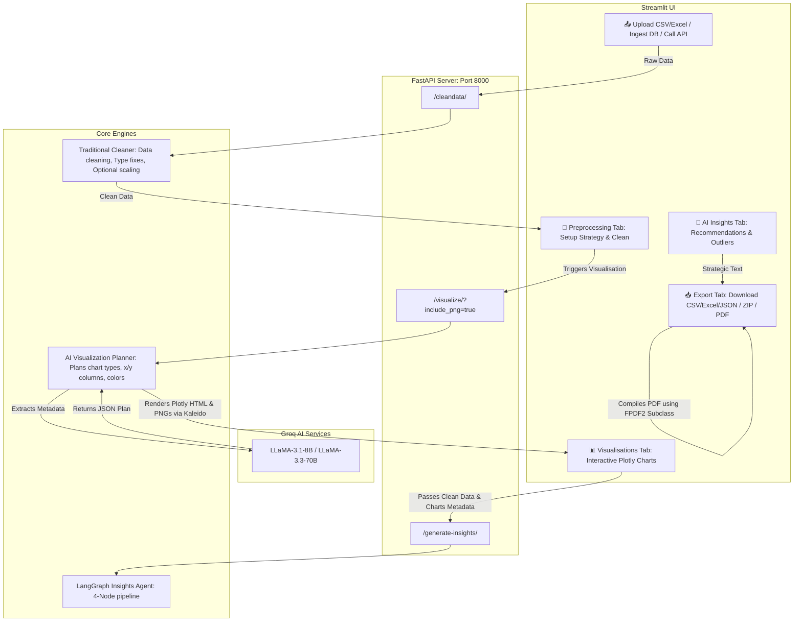
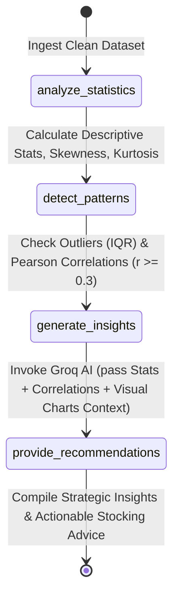

# 🤖 AI Agent for Data Cleaning, Visualisation & Business Insights

<p align="center">
  
  
  
  
  
  
</p>

<p align="center">
  <strong>A premium, business-focused data prep suite powered by FastAPI, Streamlit, and Groq AI. It automates data cleaning, generates AI-planned visualisations, drafts strategic consultant-grade insights, and builds print-ready PDF reports with zero layout overlaps.</strong>
</p>

---

## 📖 Overview

This system provides a full-featured workspace to clean, visualize, and generate insights from any raw tabular dataset. Leveraging **FastAPI** for core API services and **Streamlit** for a modern user interface, the tool uses **Groq AI (LLaMA 3.3 / LLaMA 3.1)** and **LangGraph** to perform context-aware data cleaning, select business-relevant charts, and write data-driven recommendations.

A robust **traditional fallback system** is integrated throughout, guaranteeing data cleaning, chart generation, and statistical analysis succeed instantly even in offline or rate-limited environments.

---

## ✨ Features

| Category | Feature | Description |
|----------|---------|-------------|
| 📤 **Data Ingestion** | **Multi-Source Loading** | Process CSV/Excel files, ingest queries directly from **PostgreSQL/MySQL**, or pull raw JSON from REST APIs. |
| 🧹 **Data Cleaning** | **AI-Enhanced Imputation** | Groq AI standardizes texts, identifies anomalies, and fills missing values contextually. |
| | **Robust Fallbacks** | Traditional pipelines always execute first; if the AI quota is exceeded, clean data is still returned. |
| | **Optional Normalisation** | Scaler is toggleable in the UI, keeping original data ranges visible for business reporting. |
| 📈 **Visualisations** | **AI Chart Planner** | Groq AI scans dataset metadata and plans 5 to 7 high-value business charts (e.g., product segment sales, seasonality trends). |
| | **Plotly Dashboard** | Interactive Univariate & Bivariate Plotly charts styled with custom color palettes and text wrapping. |
| | **Embedded Business Value** | Explanations underneath each chart clarify *what the chart shows* and *why it matters* to stakeholders. |
| 🤖 **Strategic Insights** | **LangGraph Business Consultant** | Multi-node agent computes descriptive stats, outliers, and Pearson correlations, drafting detailed recommendations (e.g., season-based stocking advice). |
| 📥 **Export & Reports** | **Premium PDF Reports** | Generates multi-page summary reports with custom headers, footers (page numbers), pre-cached visual charts, and AI value writeups. |
| | **Format Outputs** | Download cleaned datasets in CSV, Excel, or JSON format, and export all interactive charts as an HTML ZIP. |

---

## 🏗️ System Architecture

The following diagram illustrates how raw datasets flow from the Streamlit UI to the FastAPI backend, how the AI models plan visualisations, and how the LangGraph pipeline extracts business insights:



### 🧠 LangGraph Insights Pipeline

The insights agent uses a LangGraph `StateGraph` to orchestrate analysis step-by-step, ensuring structural checks execute before LLM advice:



---

## 📁 Project Structure

```
AgenticDataPreprocessing/
│
├── 📄 .env                         # API Keys (Groq) and Database Configurations
├── 📄 README.md                    # Core project documentation
├── 📄 requirement.txt              # Pip requirements
├── 📄 test_generated_report.pdf    # Sample PDF output report
│
├── 📂 app/
│   └── 📄 app.py                   # Streamlit frontend & PDF compiler
│
├── 📂 data/
│   └── 📄 sales_data_sample.csv    # Sample sales dataset for local testing
│
└── 📂 Scripts/
    ├── 📄 backend.py               # FastAPI backend server & API routes
    ├── 📄 ai_agent.py              # LangGraph AI data cleaning agent
    ├── 📄 data_cleaning.py         # Traditional pandas data cleaning machine
    ├── 📄 data_visualization.py    # AI chart planner & Plotly visualisations
    ├── 📄 insights_agent.py        # LangGraph Business Insights Agent
    ├── 📄 data_ingestion.py        # Database & API connectors
    └── 📄 main.py                  # CLI/Main execution entry point
```

---

## 🛠️ Tech Stack

- **Frontend:** Streamlit, Plotly Express
- **Backend:** FastAPI, Uvicorn, Python-Multipart
- **AI Orchestration:** LangGraph, Groq SDK, python-dotenv
- **Data Engineering:** Pandas, NumPy, Scikit-learn, Openpyxl, Xlsxwriter
- **Database Connectors:** SQLAlchemy, PyMySQL, Psycopg2-binary
- **PDF Engine:** FPDF2
- **Chart Renderer:** Kaleido (headless static image export)

---

## 🚀 Getting Started

### Prerequisites

* **Python 3.10.x** (Highly recommended for package compatibility with Scipy and LangGraph).
* **Groq API Key** (Create a free key at the [Groq Console](https://console.groq.com/)).

### Installation

1. **Clone the Repository:**
   ```bash
   git clone https://github.com/AmandeepS1ngh/AgenticDataPreprocessing.git
   cd AgenticDataPreprocessing
   ```

2. **Set up Virtual Environment:**
   ```bash
   python3.10 -m venv venv
   source venv/bin/activate
   ```

3. **Install Dependencies:**
   ```bash
   pip install --upgrade pip
   pip install -r requirement.txt
   ```

4. **Configure Environment Variables:**
   Create a `.env` file in the project root:
   ```env
   # Required: Groq API Configuration
   GROQ_API_KEY=your_groq_api_key_here
   GROQ_MODEL=llama-3.1-8b-instant

   # Optional: Database configurations
   MYSQL_HOST=127.0.0.1
   MYSQL_PORT=3306
   MYSQL_USER=root
   MYSQL_PASSWORD=your_password
   MYSQL_DATABASE=your_database
   ```

---

## 🏃 Running the Application

For a fully interactive experience, start both the FastAPI server and the Streamlit frontend.

**1. Launch FastAPI Backend:**
```bash
source venv/bin/activate
uvicorn Scripts.backend:app --host 127.0.0.1 --port 8000 --reload
```

**2. Launch Streamlit UI:**
```bash
source venv/bin/activate
streamlit run app/app.py
```

Open your browser at [http://localhost:8501](http://localhost:8501) to interact with the system. Access API docs at [http://127.0.0.1:8000/docs](http://127.0.0.1:8000/docs).

---

## 📡 Backend API Reference

### 1. Clean File Upload
* **Endpoint:** `POST /cleandata/`
* **Content-Type:** `multipart/form-data`
* **Form Parameters:**
  - `file`: CSV or Excel file binary
  - `normalize`: `true` or `false` (default: `false`)
  - `strategy`: `mean`, `median`, or `mode` (imputation method)

### 2. Generate Visualisations
* **Endpoint:** `POST /visualize/`
* **Query Parameters:**
  - `include_png`: `true` or `false` (set to `true` to return Base64 PNGs for PDFs)
* **Form Parameters:**
  - `cleaned_data`: Serialized JSON string of cleaned records

### 3. Generate Strategic Insights
* **Endpoint:** `POST /generate-insights/`
* **Content-Type:** `application/json`
* **JSON Body:**
  ```json
  {
    "cleaned_data": [{"col1": "val", "col2": 123}],
    "visualization_results": { "charts": [...] }
  }
  ```

---

## 📄 PDF Report Mechanics

The premium PDF report generator is engineered for zero-maintenance stability:
- **Pre-generated Caching:** Streamlit requests static PNGs when the visualisations are first loaded. When clicking **Generate PDF**, the report prints instantly with no headless browser lag.
- **Subclass Headers/Footers:** A custom `ReportPDF(FPDF)` handles margins, drawing elegant separation lines on page headers and injecting page numbers dynamically.
- **Dynamic Image Sizing:** Automatically positions Plotly charts at `pdf.get_y()` coordinates and pushes content downward by `110mm`, avoiding overlapping text.
- **Character Cleaning:** The PDF engine overrides standard text output, filtering strings through an encoder that converts smart quotes (`’`, `“`), em-dashes (`—`), and bullets (`•`) to Latin-1 compatible signs, completely preventing runtime encoding crashes.
